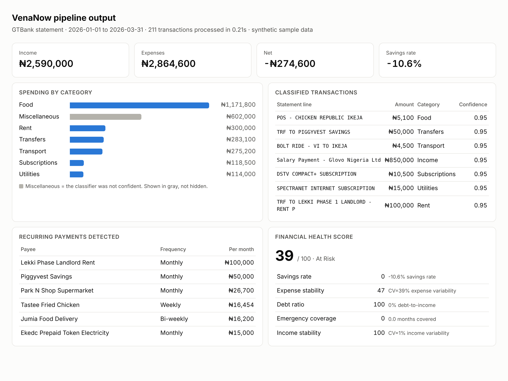
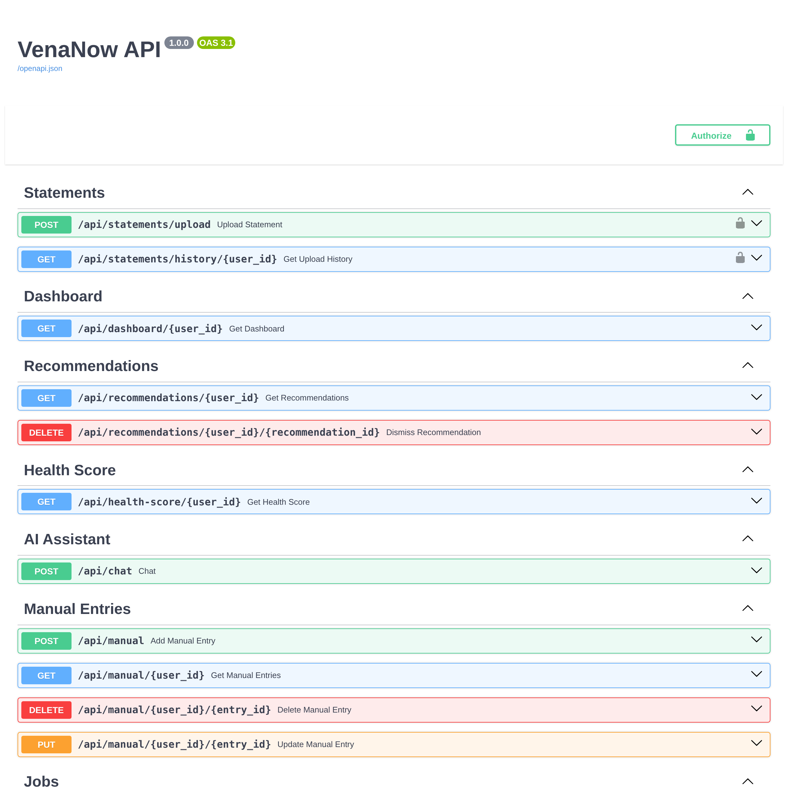

# VenaNow

**Turn a Nigerian bank statement into a clear picture of where the money went.**

Many people in Lagos earn into one account and spend through three: a salary account at GTBank, OPay for daily POS, Kuda for transfers. No single app sees all of them. The statements do, but every bank exports a different layout, PDF tables break across pages, and a line like `POS - BARCELOS LEKKI PHASE 1` means nothing to a budgeting tool built around card merchant codes from another country.

VenaNow reads the statement itself. Upload a PDF, CSV or Excel export and it returns categorised transactions, recurring payments, a 0 to 100 financial health score and a 30 day cash flow forecast.



*Real output from the pipeline on the synthetic GTBank sample: 211 transactions in 0.21 seconds. The gray bar is spending the classifier was not confident about, shown rather than hidden.*

---

## How it works

```
statement (PDF / CSV / Excel)
  -> ingestion   bank-specific column mapping into one standard table
  -> cleaning    noise rows removed, amounts normalised, duplicates dropped
  -> classifier  rules first, ML only when it is confident
  -> recurring   subscriptions and repeat transfers detected
  -> analytics   health score, cash flow forecast, recommendations
```

## The hard parts

**Every bank exports differently.** Six bank profiles are mapped today: GTBank, Zenith, UBA, Access, OPay and Kuda. The sniffer scores a statement's headers against each profile and only accepts a match on two or more columns; anything weaker falls back to generic column detection rather than forcing a wrong mapping. Nigerian bank PDFs often put account details above the transaction table, so the parser scans every row for the real header instead of trusting the first one. If table extraction fails it tries text parsing, and if that fails too it tells the user to export a CSV rather than guessing.

**The same statement gets uploaded twice.** People upload overlapping months. Every transaction gets a SHA-256 fingerprint of date, amount and description, and that column is unique in Postgres, so a re-upload cannot double count spending. A second pass catches near duplicates on date, amount and the first 40 characters of the description.

**The merchants are local.** The rules are written for Lagos: EKEDC and IKEDC for power, LAWMA for waste, DStv and GOtv, Cowrywise and PiggyVest as investments, and Bolt the ride, not Bolt in a bank name.

## Decisions, and what I rejected

**Rules before machine learning.** There is no public labelled dataset of Nigerian transactions, and a model trained on foreign data would not know what LAWMA is. Rules give a working baseline today and produce the labels a model can learn from later. A TF-IDF and logistic regression stage is built in, but it only overrides a rule when its confidence is above 0.65.

**Confidence is kept, not hidden.** A rule match scores 0.95. An unmatched credit becomes income at 0.70 and an unmatched debit becomes miscellaneous at 0.50. The score travels with every transaction so the interface can ask the user about the uncertain ones instead of presenting a guess as fact.

**Specific before generic.** Rules are first match wins, so order is a design decision. Named providers (Spectranet, EKEDC) are checked before generic words like "subscription". Testing showed why: see below.

**Money in the database is exact.** Amounts are `NUMERIC(18,2)` in Postgres, never a float column.

## What testing found

The suite has 83 tests across ingestion and classification. Running it surfaced two real bugs, both now fixed:

- `POS TOTAL ENERGIES FILLING STATION` was classed as miscellaneous. The rules knew "Total Oil" but not the 2022 TotalEnergies rebrand.
- `SPECTRANET INTERNET SUBSCRIPTION` was classed as a subscription, not a utility, because the generic word "subscription" matched before the provider name was ever checked. Utilities now run first.

Result: **83 of 83 passing.**

## Where it stops

Stated plainly, so nobody has to guess what is finished:

| Area | Status |
|---|---|
| Statement upload, background processing, job status, history, manual entries | Working |
| Health score, forecaster, recommender engines | Built and tested, not yet wired to the database |
| `/dashboard`, `/recommendations`, `/health-score` endpoints | Return placeholder responses until that wiring is done |
| Cash flow forecaster | Gives wrong results on the sample: it projects a positive month-end balance of about ₦935k while expenses exceed income and the balance is already negative. Needs fixing before it is shown to users |
| ML classifier | Built, but no trained model ships, so classification runs on rules alone |
| Coverage | About 1 in 4 sample transactions still land in miscellaneous (51 of 211 on GTBank, 6 of 24 on OPay). The misses are Lagos food chains and online stores: Barcelos, Cold Stone, Tastee, Jumia, Konga. A merchant dictionary is the next step. |
| Data | Sample statements are synthetic (`sample_data/generate_sample.py`, seed 42). Not yet validated on real statements at volume. |
| Before production | Amounts are floats inside pandas and should move to exact decimals. CORS allows every origin. The global error handler returns raw exception text to the client. All three need closing before real users. |

---

## Run it

```bash
pip install -r requirements.txt
cp .env.example .env
docker-compose up -d db
uvicorn api.main:app --reload --port 8000
python -m pytest tests -q
```

Run the pipeline on a sample statement without the API:

```python
from pipeline.processor import run_pipeline, result_to_dict
result = result_to_dict(run_pipeline("sample_data/sample_statement_gtbank.csv"))
print(result["summary"], result["category_spend"])
```

The upload endpoint requires a Supabase login token (the user ID comes from the token, not a form field), so set the Supabase keys in `.env` before calling it. Interactive API docs are at `http://localhost:8000/api/docs`:



## Project layout

```
pipeline/    ingestion, cleaner, classifier, recurring, processor
analytics/   health_score, forecaster, recommender
api/         FastAPI app, routes, Supabase auth
models/      PostgreSQL schema
utils/       naira parsing, bank profiles, logging
tests/       ingestion and classifier tests
sample_data/ synthetic GTBank and OPay statements, plus the generator
```

## Stack

Python, pandas, pdfplumber, scikit-learn, FastAPI, PostgreSQL on Supabase, Docker.
